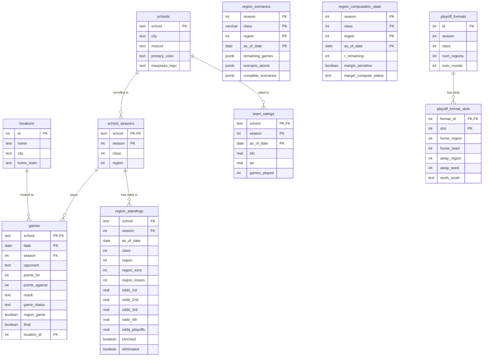

# ms-hs-football-playoff-engine

An application that calculates standings and playoff scenarios for Mississippi High School Football.

## How It Works

- Three Prefect pipelines ingest data from MHSAA, MaxPreps, and AHSFHS into PostgreSQL.
- Once game results are in, the tiebreaker engine enumerates every possible outcome across the 2^R remaining region games, applies the 7-step MHSAA tiebreaker algorithm (head-to-head record → point differential vs. highest-ranked opponent → capped per-game margin → coin flip) to determine seedings, and uses boolean minimization to reduce the scenario space into concise human-readable conditions.
- Results are stored as dated snapshots so the API can answer historical "what were the odds on date X?" queries without recomputation.
- The FastAPI layer serves those snapshots for live requests, falls back to on-demand in-memory recomputation when no snapshot exists, and exposes a simulation endpoint that lets callers apply hypothetical results to explore what-if outcomes.
- Elo ratings with a margin-of-victory multiplier and cross-season carryover drive pregame win probability, while a separate in-game model uses score margin and time remaining (plus MSHAA's untimed alternating-possession OT format) for live probability estimates.

## Data Model

The following data model describes how data is stored and controlled in this application.

### Tables

| Table | Description |
|-------|-------------|
| `schools` | Static school identity: location, mascot, colors, MaxPreps identifiers. Never duplicated across seasons. |
| `school_seasons` | Per-season class and region assignments (can change on MHSAA's two-year cycle). FK anchor for all season-scoped data. |
| `locations` | Physical venues. Referenced by `games` for geocoding and home-field logic. |
| `games` | School-perspective game rows — two rows per contest, so scores and results are always relative to the `school` column. Covers regular season and playoffs. |
| `region_standings` | Dated snapshots of seeding probabilities (1st–4th, playoff odds, home-game odds). Appended each pipeline run; never overwritten. |
| `team_ratings` | Dated Elo and RPI snapshots. One row per school per season per pipeline run. |
| `region_scenarios` | Serialized tiebreaker scenario trees (complete outcomes + minimized per-team conditions). Computed once per pipeline run, read at request time. |
| `region_computation_state` | Tracks background margin-sensitivity upgrade status per region (the two-phase computation model for regions with 5–6 games remaining). |
| `playoff_formats` | Bracket template per class/season: size, number of regions, rounds. |
| `playoff_format_slots` | First-round matchup slots. Adjacent pairs implicitly define the bracket tree for round-2 and beyond. |

### Schema Diagram



## Setting Up Your Environment

### Backend

#### Start the Docker Containers

Copy the environment template, then bring up the stack:

```
cp .env.example .env.local
docker compose --env-file .env.local --profile local-db down
docker compose --env-file .env.local --profile local-db up --build -d
```

The `--profile local-db` flag is required to start the local PostgreSQL container (`db` service). Without it, only the Prefect server/worker and API start — use that when pointing at a remote database instead.

This starts the Prefect server/worker (`localhost:4200`), a local PostgreSQL instance (`localhost:5432`), and the API server (`localhost:8000`).

To reset the database and re-run the schema from scratch (e.g. after a schema change):

```
docker compose --env-file .env.local --profile local-db down -v
docker compose --env-file .env.local --profile local-db up --build -d
```

The `-v` flag removes the postgres data volume; the container will re-run `sql/init.sql` on startup.

#### Once per season (pre-season setup)

Run these in order — each depends on the previous step's data being in the database.

1. Navigate to [the Local Prefect UI](http://localhost:4200/deployments)
2. Do a "Quick Run" of the **Regions Data Pipeline** — populates `school_seasons` (class/region assignments)
   1. Note - The "Regions Data" Pipeline defaults to the current currantly year. Use a **Custom Run** in the Prefect UI to target a different season.
3. Do a "Quick Run" of the **MaxPreps Data Pipeline** — populates `schools` (metadata) and seeds `games` rows for the schedule
4. Do a "Quick Run" of the **School Info Data Pipeline** — fills in school identity details (colors, mascot, etc.)

Re-run these if MHSAA reclassifies schools (every two years) or if the playoff format changes.

The `playoff_formats` and `playoff_format_slots` tables (which define the bracket structure) are **automatically seeded for 2025** by `sql/init.sql` when the database is created — no manual step is needed. See [New Season Setup](#new-season-setup) below for adding a future season.

#### Once per week (during the season)

1. Do a "Quick Run" of the **AHSFHS Schedule Data Pipeline** — fetches the latest scores and marks games `final=TRUE`
2. Do a "Quick Run" of the **Region Scenarios Pipeline** — reads the updated game results, runs the tiebreaker engine, and writes pre-computed standings odds and scenario data to `region_standings` and `region_scenarios`

> **Season parameter:** Both of these pipelines default to the current calendar year. Use a **Custom Run** in the Prefect UI to target a different season.

The API reads its data from these pre-computed snapshots; run this pipeline before serving fresh results.

#### Once per season (after importing a full historical season)

After the AHSFHS and Region Scenarios pipelines have run for the first time on a season, run the **Backfill Historical Snapshots** pipeline from the [Local Prefect UI](http://localhost:4200/deployments).

> **Season parameter:** This pipeline defaults to the current calendar year. Use a **Custom Run** in the Prefect UI to target a different season.

This populates dated snapshots in `team_ratings`, `region_standings`, `region_scenarios`, and `region_computation_state` for each unique game-week so the timeline API can serve historical odds for any past date without recomputation. Only needs to run once per season (or again after re-importing a full season's games).

### New Season Setup

When MHSAA reclassifies schools (every two years) or the bracket structure changes, add playoff format data for the new season:

1. Copy `sql/seeds/playoff_format_template.yaml` to `sql/seeds/playoff_formats_YYYY.yaml`
2. Fill in the `season`, `classes`, and `slots` fields to match the MHSAA bracket
3. Run:

```
uv run python backend/scripts/add_playoff_season.py --config sql/seeds/playoff_formats_YYYY.yaml
```

Use `--dry-run` first to preview what will be inserted. The script is idempotent — re-running for the same season skips rows that already exist.

## Development Reference

### Setup

#### UV

This project uses [uv](https://docs.astral.sh/uv/) for dependency management and [ruff](https://docs.astral.sh/ruff/) for linting/formatting.

Install dependencies (creates `.venv` automatically):

```
uv sync --dev
```

### Linting

```
uv run ruff check .          # lint
uv run ruff check --fix .    # auto-fix safe issues
uv run ruff format .         # format (black-compatible)
```

### Testing

Run the test suite from the repo root (coverage is enabled by default via `pyproject.toml`):

```
uv run pytest
```

Or with verbose output:

```
uv run pytest -vv
```

Coverage is measured with branch analysis and reported in the terminal after every run. The report excludes Prefect pipeline files (which require a live DB/Prefect environment) and focuses on the pure-logic modules: `tiebreakers.py`, `scenarios.py`, `data_helpers.py`, and `data_classes.py`.

To generate a browsable HTML report:

```
uv run pytest --cov-report=html
open htmlcov/index.html
```

### Docstring coverage

Check that all public functions and modules have docstrings:

```
uv run docstr-coverage backend
```

The report excludes pipeline files (same omit list as test coverage) and skips magic methods and `__init__`. Current baseline: 100%.

### API Reference

All endpoints are under `/api/v1`. Interactive docs available at `/docs` when the server is running.

#### Meta

| Method | Path | Description |
|--------|------|-------------|
| GET | `/seasons` | List all seasons that have enrolled teams |
| GET | `/seasons/{season}/structure` | All classes and regions with team counts for a season |
| GET | `/teams` | List teams; `season` required, optional `class` and `region` filters |
| GET | `/teams/{team}` | Metadata for a single team in a season |
| GET | `/teams/{team}/helmets` | All helmet designs for a team; optional `year` filter |
| GET | `/helmets` | Browse helmets across all teams; filters: `team`, `color`, `finish`, `tag` |

#### Standings — `/standings`

| Method | Path | Description |
|--------|------|-------------|
| GET | `/{clazz}/{region}` | Seeding odds for all teams; includes human-readable scenarios when ≤6 games remain. Params: `season`, `date` |
| GET | `/{clazz}/{region}/teams/{team}` | Same, filtered to one team |
| POST | `/{clazz}/{region}/simulate` | Apply hypothetical game results and return updated seeding odds |
| POST | `/{clazz}/{region}/teams/{team}/simulate` | Same, filtered to one team |

#### Hosting — `/hosting`

| Method | Path | Description |
|--------|------|-------------|
| GET | `/{clazz}/{region}` | Playoff home-game odds per round (1st round through semifinals) for all teams |
| GET | `/{clazz}/{region}/teams/{team}` | Same, filtered to one team |
| POST | `/{clazz}/{region}/simulate` | Apply hypothetical results and return updated hosting odds |
| POST | `/{clazz}/{region}/teams/{team}/simulate` | Same, filtered to one team |

#### Bracket — `/bracket`

| Method | Path | Description |
|--------|------|-------------|
| GET | `/` | Advancement odds for every seed slot in a class. Params: `season`, `class`, `date` |
| POST | `/simulate` | Apply hypothetical bracket results and return updated advancement odds |

#### Games — `/games`

| Method | Path | Description |
|--------|------|-------------|
| GET | `/` | Game schedule; filter by `season`, `class`, `region`, `team`, `date_from`, `date_to` |
| GET | `/probability` | Pre-game win probability (Elo-based). Params: `team_a`, `team_b`, `season`, `location` |
| POST | `/probability/live` | In-game win probability. Body: `pregame_prob`, `current_margin`, `seconds_remaining` |
| POST | `/probability/overtime` | MSHAA OT win probability. Body: `pregame_prob`, `ot_scored_margin` |

#### Ratings — `/ratings`

| Method | Path | Description |
|--------|------|-------------|
| GET | `/` | Elo and RPI for teams; filter by `season`, `class`, `region`, `team`; sorted by Elo descending |
| GET | `/{team}/trend` | Elo time-series for one team. Optional `date_from` / `date_to` |
