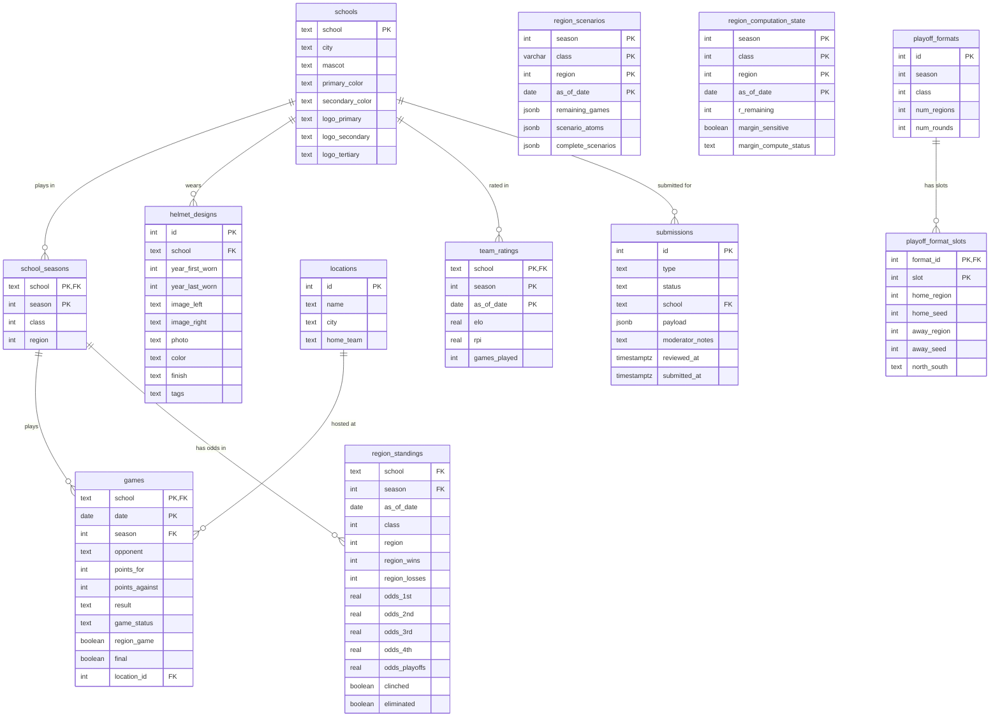

# ms-hs-football-playoff-engine

An application that calculates standings and playoff scenarios for Mississippi High School Football.

## How It Works

- Four Prefect pipelines ingest data from MHSAA (region assignments and school identity), the NCES EDGE API (school locations), and AHSFHS (schedules) into PostgreSQL.
- Once game results are in, the tiebreaker engine enumerates every possible outcome across the 2^R remaining region games, applies the 7-step MHSAA tiebreaker algorithm (head-to-head record → point differential vs. highest-ranked opponent → capped per-game margin → coin flip) to determine seedings, and uses boolean minimization to reduce the scenario space into concise human-readable conditions.
- Results are stored as dated snapshots so the API can answer historical "what were the odds on date X?" queries without recomputation.
- The FastAPI layer serves those snapshots for live requests, falls back to on-demand in-memory recomputation when no snapshot exists, and exposes a simulation endpoint that lets callers apply hypothetical results to explore what-if outcomes.
- Elo ratings with a margin-of-victory multiplier and cross-season carryover drive pregame win probability, while a separate in-game model uses score margin and time remaining (plus MSHAA's untimed alternating-possession OT format) for live probability estimates.

## Data Model

The following data model describes how data is stored and controlled in this application.

### Tables

| Table | Description |
|-------|-------------|
| `schools` | Static school identity: location (city, zip, lat/lon), mascot, colors, and Cloudinary logo paths (`logo_primary`, `logo_secondary`, `logo_tertiary`). Never duplicated across seasons. |
| `helmet_designs` | Per-school helmet design history. One row per distinct design; `year_first_worn`/`year_last_worn` span multiple seasons. Stores Cloudinary image paths for left-view mockup, right-view mockup, and photo. |
| `school_seasons` | Per-season class and region assignments (can change on MHSAA's two-year cycle). FK anchor for all season-scoped data. |
| `locations` | Physical venues. Referenced by `games` for geocoding and home-field logic. |
| `games` | School-perspective game rows — two rows per contest, so scores and results are always relative to the `school` column. Covers regular season and playoffs. |
| `region_standings` | Dated snapshots of seeding odds (1st–4th, raw and strength-weighted), playoff odds, playoff bracket advancement odds (2nd round through champion), and home-game odds per round. Appended each pipeline run; never overwritten. |
| `team_ratings` | Dated Elo and RPI snapshots. One row per school per season per `as_of_date`. |
| `region_scenarios` | Serialized tiebreaker scenario trees (complete outcomes + minimized per-team conditions). Computed once per pipeline run, read at request time. |
| `region_computation_state` | Tracks background margin-sensitivity upgrade status per region (the two-phase computation model for regions with 5–6 games remaining). |
| `playoff_formats` | Bracket template per class/season: size, number of regions, rounds. |
| `playoff_format_slots` | First-round matchup slots. Adjacent pairs implicitly define the bracket tree for round-2 and beyond. |
| `submissions` | User-submitted corrections and new assets (logos, helmet designs, colors, GPS coordinates, scores, feedback). Rows enter the queue with `status='pending'` and are approved or rejected by a moderator via the moderation API. Approved submissions are auto-applied to the live tables (except helmet submissions, which require manual mockup creation). |

### Schema Diagram



## Setting Up Your Environment

### Backend

#### Start the Docker Containers

Copy the environment template, then bring up the stack:

```
cp .env.example .env.local
docker compose --env-file .env.local --profile local-db down
docker compose --env-file .env.local --profile local-db up --build -d
```

The `--profile local-db` flag is required to start the local PostgreSQL container (`db` service). Without it, only the Prefect server/worker and API start — use that when pointing at a remote database instead.

This starts the Prefect server/worker (`localhost:4200`), a local PostgreSQL instance (`localhost:5432`), and the API server (`localhost:8000`).

To reset the database and re-run the schema from scratch (e.g. after a schema change):

```
docker compose --env-file .env.local --profile local-db down -v
docker compose --env-file .env.local --profile local-db up --build -d
```

The `-v` flag removes the postgres data volume; the container will re-run `sql/init.sql` on startup.

#### Once per season (pre-season setup)

Run these in order — each depends on the previous step's data being in the database.

1. Navigate to [the Local Prefect UI](http://localhost:4200/deployments)
2. Do a "Quick Run" of the **Regions Data Pipeline** — populates `school_seasons` (class/region assignments)
   - The pipeline defaults to the current year. Use a **Custom Run** in the Prefect UI to target a different season.
3. Do a "Quick Run" of the **NCES School Geographic Data Flow** — fills in city, zip, latitude, and longitude for all public schools from the NCES EDGE API, then applies the private-school location seed for schools not in NCES
4. Do a "Quick Run" of the **MHSAA School Identity Data Flow** — scrapes mascot and primary/secondary colors from the MHSAA school directory
5. Do a "Quick Run" of the **AHSFHS Schedule Data Pipeline** with the target season — seeds `schools` and `games` rows from the schedule

Re-run steps 3-4 if schools move or rebrand. Re-run step 2 if MHSAA reclassifies schools (every two years) or if the playoff format changes.

The `playoff_formats` and `playoff_format_slots` tables (which define the bracket structure) are **automatically seeded for 2025** by `sql/init.sql` when the database is created — no manual step is needed. See [New Season Setup](#new-season-setup) below for adding a future season.

#### Once per week (regular season)

1. Do a "Quick Run" of the **AHSFHS Schedule Data Pipeline** — fetches the latest scores and marks games `final=TRUE`
2. Do a "Quick Run" of the **Region Scenarios Pipeline** — reads the updated game results, runs the tiebreaker engine, and writes pre-computed standings odds and scenario data to `region_standings` and `region_scenarios`

> **Season parameter:** Both of these pipelines default to the current calendar year. Use a **Custom Run** in the Prefect UI to target a different season.

The API reads its data from these pre-computed snapshots; run this pipeline before serving fresh results.

#### After each playoff round

1. Do a "Quick Run" of the **AHSFHS Schedule Data Pipeline** — fetches playoff scores and marks games `final=TRUE`
2. Do a "Quick Run" of the **Playoff Bracket Update** pipeline — reads completed playoff results, marks eliminated teams, sets alive teams to deterministic 1.0/0.0 seeding odds, and writes one `region_standings` snapshot per class/region dated to that round's game date

> **Season parameter:** This pipeline defaults to the current calendar year. Use a **Custom Run** in the Prefect UI to target a different season.

Run this after each round concludes (first round, second round, semifinals, finals). The Region Scenarios Pipeline does **not** need to re-run during the playoffs — seedings are fully determined at that point.

#### Once per season (after importing a full historical season)

After the AHSFHS and Region Scenarios pipelines have run for the first time on a season, run the **Backfill Historical Snapshots** pipeline from the [Local Prefect UI](http://localhost:4200/deployments).

This populates dated snapshots in `team_ratings`, `region_standings`, `region_scenarios`, and `region_computation_state` for each unique game-week so the timeline API can serve historical odds for any past date without recomputation. Only needs to run once per season (or again after re-importing a full season's games).

Then run the **Playoff Bracket Update** pipeline with the same historical season via a **Custom Run**. It is self-backfilling: it reads all completed playoff games for that season and writes one `region_standings` snapshot per playoff round date automatically — no separate per-round runs needed for past seasons.

> **Season parameter:** These pipelines default to the current calendar year. Use a **Custom Run** in the Prefect UI to target a different season.

### New Season Setup

When MHSAA reclassifies schools (every two years) or the bracket structure changes, add playoff format data for the new season via the admin API:

1. Copy `sql/seeds/playoff_format_template.yaml` to `sql/seeds/playoff_formats_YYYY.yaml` and fill in `season`, `classes`, and `slots` to match the MHSAA bracket — use this as your source of truth.
2. POST the same data as JSON to `POST /api/v1/admin/playoff-format` (or use the Swagger UI at [localhost:8000/docs](http://localhost:8000/docs)).
3. Use `?dry_run=true` first to preview the row counts without writing. The endpoint is idempotent — re-running for the same season skips rows that already exist.

After the championship games are ingested by the AHSFHS pipeline, assign the venue:

1. `GET /api/v1/admin/locations` to find the correct `location_id` for the venue.
2. `POST /api/v1/admin/championship-venue` with `{ "season": YYYY, "location_id": N }`.
3. Use `?dry_run=true` first to confirm which game rows will be updated.

## Development Reference

### Setup

#### UV

This project uses [uv](https://docs.astral.sh/uv/) for dependency management and [ruff](https://docs.astral.sh/ruff/) for linting/formatting.

Install dependencies (creates `.venv` automatically):

```
uv sync --dev
```

### Linting

```
uv run ruff check .          # lint
uv run ruff check --fix .    # auto-fix safe issues
uv run ruff format .         # format (black-compatible)
```

### Testing

Run the test suite from the repo root (coverage is enabled by default via `pyproject.toml`):

```
uv run pytest
```

Or with verbose output:

```
uv run pytest -vv
```

Coverage is measured with branch analysis and reported in the terminal after every run. The report excludes Prefect pipeline files (which require a live DB/Prefect environment) and focuses on the pure-logic modules: `tiebreakers.py`, `scenarios.py`, `data_helpers.py`, and `data_classes.py`.

To generate a browsable HTML report:

```
uv run pytest --cov-report=html
open htmlcov/index.html
```

### Docstring coverage

Check that all public functions and modules have docstrings:

```
uv run docstr-coverage backend
```

The report excludes pipeline files (same omit list as test coverage) and skips magic methods and `__init__`. Current baseline: 100%.

### API Reference

All endpoints are under `/api/v1`. Interactive docs are at [localhost:8000/docs](http://localhost:8000/docs) when the server is running.

#### Meta

| Method | Path | Description |
|--------|------|-------------|
| GET | `/seasons` | List all seasons that have enrolled teams |
| GET | `/seasons/{season}/structure` | All classes and regions with team counts for a season |
| GET | `/teams` | List teams; `season` required, optional `class` and `region` filters |
| GET | `/teams/{team}` | Metadata for a single team in a season |
| GET | `/teams/{team}/helmets` | All helmet designs for a team; optional `year` filter |
| GET | `/helmets` | Browse helmets across all teams; filters: `team`, `color`, `finish`, `tag` |

#### Standings — `/standings`

| Method | Path | Description |
|--------|------|-------------|
| GET | `/{clazz}/{region}` | Seeding odds for all teams; includes human-readable scenarios when ≤6 games remain. Params: `season`, `date`. See [docs/SCENARIO_COMPUTATION.md](docs/SCENARIO_COMPUTATION.md) for the full computation model. |
| GET | `/{clazz}/{region}/teams/{team}` | Same, filtered to one team |
| POST | `/{clazz}/{region}/simulate` | Apply hypothetical game results and return updated seeding odds |
| POST | `/{clazz}/{region}/teams/{team}/simulate` | Same, filtered to one team |

#### Hosting — `/hosting`

| Method | Path | Description |
|--------|------|-------------|
| GET | `/{clazz}/{region}` | Playoff home-game odds per round (1st round through semifinals) for all teams |
| GET | `/{clazz}/{region}/teams/{team}` | Same, filtered to one team |
| POST | `/{clazz}/{region}/simulate` | Apply hypothetical results and return updated hosting odds |
| POST | `/{clazz}/{region}/teams/{team}/simulate` | Same, filtered to one team |

#### Bracket — `/bracket`

| Method | Path | Description |
|--------|------|-------------|
| GET | `/` | Advancement odds for every seed slot in a class. Params: `season`, `class`, `date` |
| POST | `/simulate` | Apply hypothetical bracket results and return updated advancement odds |

#### Games — `/games`

| Method | Path | Description |
|--------|------|-------------|
| GET | `/` | Game schedule; filter by `season`, `class`, `region`, `team`, `date_from`, `date_to` |
| GET | `/probability` | Pre-game win probability (Elo-based). Params: `team_a`, `team_b`, `season`, `location` |
| POST | `/probability/live` | In-game win probability. Body: `pregame_prob`, `current_margin`, `seconds_remaining` |
| POST | `/probability/overtime` | MSHAA OT win probability. Body: `pregame_prob`, `ot_scored_margin` |

#### Ratings — `/ratings`

| Method | Path | Description |
|--------|------|-------------|
| GET | `/` | Elo and RPI for teams; filter by `season`, `class`, `region`, `team`; sorted by Elo descending |
| GET | `/{team}/trend` | Elo time-series for one team. Optional `date_from` / `date_to` |

#### Admin — `/admin`

**Season setup**

| Method | Path | Description |
|--------|------|-------------|
| POST | `/playoff-format` | Seed `playoff_formats` + `playoff_format_slots` for a new season. Idempotent. `?dry_run=true` to preview counts without writing |
| POST | `/championship-venue` | Set `location_id = neutral` on all Championship Game rows for a season. `?dry_run=true` to preview affected rows without writing |

**Overrides** — the three base tables (`schools`, `games`, `locations`) each have an `overrides` JSONB column that wins over the pipeline-written value on read (via the `*_effective` views). Use these endpoints instead of raw SQL when you need to correct a pipeline error without touching the source data.

| Method | Path | Description |
|--------|------|-------------|
| GET | `/overrides` | Audit all active manual overrides across schools, locations, and games |
| PUT | `/schools/{school}/overrides` | Set one override field on a school. Body: `{ "field": "display_name", "value": "West Jones" }`. Valid fields: `display_name`, `mascot`, `primary_color`, `secondary_color`, `primary_color_hex`, `secondary_color_hex`, `latitude`, `longitude` |
| DELETE | `/schools/{school}/overrides/{field}` | Clear one override field, restoring the pipeline-written value |
| PUT | `/games/{school}/{date}/overrides` | Set one override field on a game row (e.g. fix a miscategorized region game or a wrong score). Valid fields: `location`, `location_id`, `points_for`, `points_against`, `region_game`, `round`, `kickoff_time` |
| DELETE | `/games/{school}/{date}/overrides/{field}` | Clear one override field on a game row |
| PUT | `/locations/{id}/overrides` | Set one override field on a venue. Valid fields: `home_team`, `latitude`, `longitude` |
| DELETE | `/locations/{id}/overrides/{field}` | Clear one override field on a venue |

**Games (manual-only columns)**

| Method | Path | Description |
|--------|------|-------------|
| PUT | `/games/{school}/{date}/helmet` | Assign or clear the helmet design worn by `school` in a game. Body: `{ "helmet_design_id": 42 }` (or `null` to clear) |

**School seasons**

| Method | Path | Description |
|--------|------|-------------|
| PATCH | `/school-seasons/{school}/{season}` | Toggle `is_active` for a school in a season (pipeline never writes this column). Body: `{ "is_active": false }` |

**Locations CRUD** — the pipeline never writes this table; venues are otherwise seeded by SQL only.

| Method | Path | Description |
|--------|------|-------------|
| GET | `/locations` | List all venues (id, name, city, home_team); use to look up `location_id` for other admin calls |
| POST | `/locations` | Add a new venue. Body: `name` (required), `city`, `home_team`, `latitude`, `longitude`. Returns full record including `id`. 409 on duplicate `(name, city, home_team)` |
| PATCH | `/locations/{id}` | Partial update of any venue field. Only provided fields are written |

**Helmet designs CRUD** — the pipeline never writes this table. Create a record first to get an `id`, then upload images via `POST /images/helmets/{id}/{type}`.

| Method | Path | Description |
|--------|------|-------------|
| POST | `/helmets` | Create a new helmet design record. Body: `school` (required), `year_first_worn` (required), plus optional `year_last_worn`, `years_worn`, `color`, `finish`, `facemask_color`, `logo`, `stripe`, `tags`, `notes`. Returns full record including generated `id` |
| PATCH | `/helmets/{id}` | Partial update of any metadata field (not image columns). Only provided fields are written |
| DELETE | `/helmets/{id}` | Delete a helmet design. Any games referencing it have `helmet_design_id` set to NULL automatically |

#### Images — `/images`

Upload images to Cloudinary and write the resulting path back to the database. Returns `{ "path": "...", "url": "https://..." }`.

| Method | Path | Description |
|--------|------|-------------|
| POST | `/logos/{school}/{logo_type}` | Upload a school logo (`primary`, `secondary`, or `tertiary`). Updates `schools.logo_{type}`. |
| POST | `/helmets/{helmet_design_id}/{image_type}` | Upload a helmet image (`left`, `right`, or `photo`). Looks up school and year from the existing `helmet_designs` row, uploads to `helmets/{type}/{School}_{year}_{id}`, and updates the corresponding column. |

#### Submissions — `/submissions`

Unauthenticated endpoints for user-submitted corrections and new assets. Submissions enter a moderation queue with `status='pending'` and are not applied to the live database until approved via the moderation API.

| Method | Path | Description |
|--------|------|-------------|
| POST | `/logos` | Submit a school logo for moderator review. Multipart: `school`, `logo_type` (`primary`/`secondary`/`tertiary`), `file`. Image is staged on Cloudinary and promoted to production on approval. 404 if school not found. |
| POST | `/helmets` | Submit a helmet design for moderator review. Multipart: `school`, `year_first_worn`, `description`, plus optional metadata fields and up to 5 reference images (`images`) and an optional logo image (`logo_image`). Moderator creates the helmet record manually from the submitted info. 404 if school not found. |
| POST | `/colors` | Submit a school color correction. Body: `school`, optional `primary_color` `{name, hex}`, optional `secondary_colors` array. Auto-applied on approval via `set_school_override`. 404 if school not found. |
| POST | `/locations` | Submit corrected GPS coordinates for a school. Body: `school`, `latitude`, `longitude`. Auto-applied on approval via `set_school_override`. 404 if school not found. |
| POST | `/scores` | Submit a corrected game score. Body: `school`, `date`, `points_for`, `points_against`. Both the school and the game row must already exist. Auto-applied on approval via `set_game_override`. 404 if school or game not found. |
| POST | `/feedback` | Submit general feedback (no school required). Body: `subject`, `message`. No DB action is taken on approval. |

#### Moderation — `/moderation`

Requires the `X-Moderator-Key` header to match the `MODERATOR_API_KEY` environment variable.

| Method | Path | Description |
|--------|------|-------------|
| GET | `/submissions` | List submissions. Optional query params: `type` (`logo`/`helmet`/`colors`/`location`/`score`/`feedback`), `status_filter` (`pending`/`approved`/`rejected`), `limit` (default 50), `offset` |
| GET | `/submissions/{id}` | Get a single submission with its full payload. 404 if not found. |
| POST | `/submissions/{id}/approve` | Approve a pending submission and auto-apply it to the live database. Optional body: `{ "notes": "..." }`. 404 if not found; 409 if already reviewed. |
| POST | `/submissions/{id}/reject` | Reject a pending submission. No changes are applied to the database. Optional body: `{ "notes": "..." }`. 404 if not found; 409 if already reviewed. |
