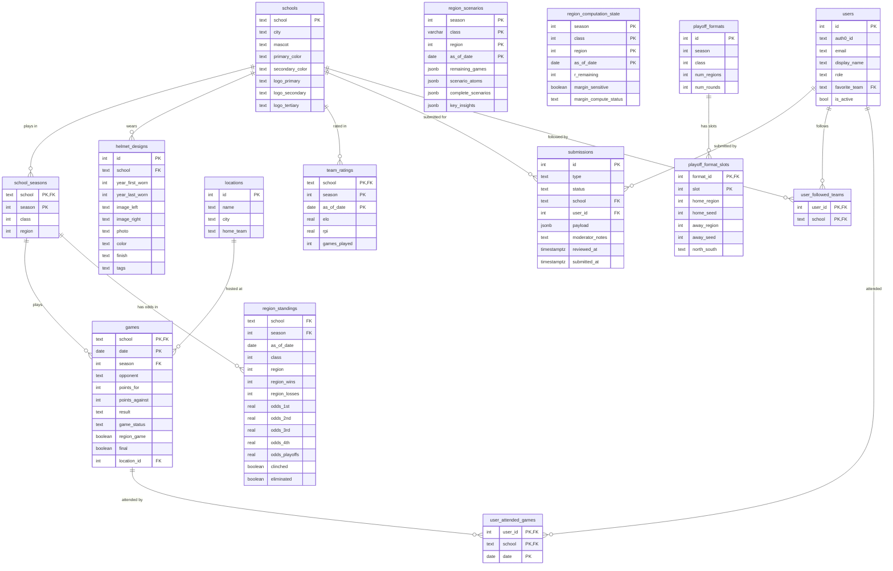

# ms-hs-football-playoff-engine

An application that calculates standings and playoff scenarios for Mississippi High School Football.

## How It Works

- Four Prefect pipelines ingest data from MHSAA (region assignments and school identity), the NCES EDGE API (school locations), and AHSFHS (schedules) into PostgreSQL.
- Once game results are in, the tiebreaker engine enumerates every possible outcome across the 2^R remaining region games, applies the 7-step MHSAA tiebreaker algorithm (head-to-head record → point differential vs. highest-ranked opponent → capped per-game margin → coin flip) to determine seedings, and uses boolean minimization to reduce the scenario space into concise human-readable conditions.
- Results are stored as dated snapshots so the API can answer historical "what were the odds on date X?" queries without recomputation.
- The FastAPI layer serves those snapshots for live requests, falls back to on-demand in-memory recomputation when no snapshot exists, and exposes a simulation endpoint that lets callers apply hypothetical results to explore what-if outcomes.
- Elo ratings with a margin-of-victory multiplier and cross-season carryover drive pregame win probability, while a separate in-game model uses score margin and time remaining (plus MSHAA's untimed alternating-possession OT format) for live probability estimates.

## Data Model

The following data model describes how data is stored and controlled in this application.

### Tables

| Table | Description |
|-------|-------------|
| `schools` | Static school identity: location (city, zip, lat/lon), mascot, colors, and Cloudinary logo paths (`logo_primary`, `logo_secondary`, `logo_tertiary`). Never duplicated across seasons. |
| `helmet_designs` | Per-school helmet design history. One row per distinct design; `year_first_worn`/`year_last_worn` span multiple seasons. Stores Cloudinary image paths for left-view mockup, right-view mockup, and photo. |
| `school_seasons` | Per-season class and region assignments (can change on MHSAA's two-year cycle). FK anchor for all season-scoped data. |
| `locations` | Physical venues. Referenced by `games` for geocoding and home-field logic. |
| `games` | School-perspective game rows — two rows per contest, so scores and results are always relative to the `school` column. Covers regular season and playoffs. |
| `region_standings` | Dated snapshots of seeding odds (1st–4th, raw and strength-weighted), playoff odds, playoff bracket advancement odds (2nd round through champion), and home-game odds per round. Appended each pipeline run; never overwritten. |
| `team_ratings` | Dated Elo and RPI snapshots. One row per school per season per `as_of_date`. |
| `region_scenarios` | Serialized tiebreaker scenario trees (complete outcomes + minimized per-team conditions) plus pre-computed key insights (simple, unconditionally-true conditional statements like "Taylorsville clinches 1st seed: Taylorsville beats Stringer"). Computed once per pipeline run, read at request time. |
| `region_computation_state` | Tracks background margin-sensitivity upgrade status per region (the two-phase computation model for regions with 5–6 games remaining). |
| `playoff_formats` | Bracket template per class/season: size, number of regions, rounds. |
| `playoff_format_slots` | First-round matchup slots. Adjacent pairs implicitly define the bracket tree for round-2 and beyond. |
| `submissions` | User-submitted corrections and new assets (logos, helmet designs, colors, GPS coordinates, scores, feedback). Rows enter the queue with `status='pending'` and are approved or rejected by a moderator via the moderation API. Approved submissions are auto-applied to the live tables (except helmet submissions, which require manual mockup creation). Has an optional `user_id` FK for linking submissions to registered users. |
| `users` | Registered user accounts with role (`user`/`moderator`/`owner`), profile fields (display name, phone, hometown), and a favorite team FK. Identity is managed by Auth0; `auth0_id` stores the Auth0 `sub` claim. Rows are lazy-provisioned on first authenticated request. |
| `user_followed_teams` | Many-to-many join between users and the schools they follow. |
| `user_attended_games` | Many-to-many join between users and games they marked as attended. References the composite PK `(school, date)` on `games`. |

### Schema Diagram



## Prerequisites

Before starting, create accounts and note your credentials for:

- **Auth0** (auth0.com) — you'll need `AUTH0_DOMAIN` and `AUTH0_AUDIENCE` from your tenant settings
- **Cloudinary** (cloudinary.com) — you'll need `CLOUDINARY_CLOUD_NAME`, `CLOUDINARY_API_KEY`, and `CLOUDINARY_API_SECRET`

## Setting Up Your Environment

### Backend

#### Start the Docker Containers

Copy the environment template, fill in `AUTH0_DOMAIN` and `AUTH0_AUDIENCE` from your Auth0 dashboard (see **Configure Auth0** below), then bring up the stack:

```
cp .env.example .env.local
docker compose -f docker-compose.yml -f docker-compose.local.yml --env-file .env.local --profile local-db up --build -d
```

The `--profile local-db` flag is required to start the local PostgreSQL container (`db` service). On a VM with an external database, omit it.

This starts nginx (`localhost:80`), Prefect server/worker (internal), and a local PostgreSQL instance (`localhost:5432`).

> **nginx reverse proxy**: All traffic enters through nginx on port 80. The Prefect UI is accessible at `http://localhost/prefect/` but requires a valid moderator `Authorization: Bearer <token>` header.

#### Accessing the Prefect UI (temporary workaround)

Browsers can't set custom headers on navigation requests, so until an admin frontend exists, use the **[ModHeader](https://modheader.com)** browser extension (Chrome/Firefox):

1. Install ModHeader and add a request header:
   - **Name**: `Authorization`
   - **Value**: `Bearer <your token>`
   - Set a URL filter to `localhost` so it only applies locally
2. Get your token from Swagger UI — after authorizing, execute any endpoint (e.g. `GET /api/v1/users/me`) and copy the token from the `Authorization: Bearer ...` line in the curl command shown
3. Navigate to `http://localhost/prefect/`

Auth0 access tokens expire (typically after 24 hours), so you'll need to copy a fresh token from Swagger UI when that happens.

> **Future**: once an admin frontend exists, this will be replaced by cookie-based session auth so the Prefect UI is accessible via a normal link after logging in.

#### Configure Auth0

Auth0 issues the RS256 JWT tokens the API validates. You need two things: an **API resource** (sets the audience claim) and an **Application** (sets your domain and gives you Swagger UI login credentials).

**Step 1 — Create the API resource**

1. Log in to [manage.auth0.com](https://manage.auth0.com).
2. Go to **Applications → APIs → Create API**.
3. Set **Name** to anything descriptive (e.g. `mshsfbanalytics`).
4. Set **Identifier** to your chosen audience string — this becomes `AUTH0_AUDIENCE` in your `.env` files. You cannot change this after creation.
5. Leave **Signing Algorithm** as `RS256`. Click **Create**.

**Step 2 — Create the Application**

1. Go to **Applications → Applications → Create Application**.
2. Set **Name** to anything descriptive (e.g. `mshsfbanalytics-local`).
3. Select **Regular Web Application**. Click **Create**.
4. Open the **Settings** tab. Note these three values — you will need them shortly:
   - **Domain** → becomes `AUTH0_DOMAIN` (e.g. `yourapp.us.auth0.com`)
   - **Client ID**
   - **Client Secret** (click reveal)

**Step 3 — Allow localhost as an origin**

The Swagger UI uses Auth0's Universal Login and redirects back to Swagger UI after login, so Auth0 needs to allow both the origin and the redirect URI. Still on the Application Settings page, add the following values:

- **Allowed Callback URLs**: `http://localhost:8000/docs/oauth2-redirect`
- **Allowed Web Origins**: `http://localhost:8000`
- **Allowed Origins (CORS)**: `http://localhost:8000`

Click **Save Changes**.

**Step 4 — Authorize the Application to access the API**

1. Go to **Applications → APIs** and click on your API (`mshsfbanalytics`).
2. Open the **Application Access** tab.
3. Find your application (`mshsfbanalytics-local`) and toggle it **on**. Click **Update**.

**Step 5 — Copy credentials to your `.env` files**

In both `.env.local` and `.env.non-docker.local`:

```
AUTH0_DOMAIN=<Domain from Step 2>
AUTH0_AUDIENCE=<Identifier from Step 1>
```

Keep the **Client ID** and **Client Secret** from Step 2 handy — you'll enter them in the Swagger UI Authorize dialog when promoting yourself to owner.

#### Start the API (local development)

The FastAPI API runs **outside Docker** in local development due to a Docker Desktop on Apple Silicon limitation with asymmetric crypto. Run it natively against the Dockerized PostgreSQL:

```
cp .env.example .env.non-docker.local   # fill in all vars + POSTGRES_HOST=localhost
backend/scripts/start-api.sh
```

The script checks that the port is free, starts the server in the background, and waits until it's ready before returning. Logs go to `api.log` in the project root. Can be run from any directory.

```
tail -f api.log                    # stream logs
backend/scripts/stop-api.sh       # stop the server
```

The API is then available directly at `http://localhost:8000`. Swagger UI is at `http://localhost:8000/docs`.

#### Promote yourself to owner

The owner role grants access to admin and moderation endpoints. Without it, your account is a base `user` and you won't be able to approve submissions, manage other users, or access the Prefect UI.

User rows are lazy-provisioned on the first authenticated API request, so you need to log in before the SQL update will find anything. Since there is no frontend yet, create your user directly in the Auth0 dashboard first:

1. In the Auth0 dashboard, go to **User Management → Users → Create User**.
2. Enter an email and password. Leave **Connection** as `Username-Password-Authentication`. Click **Create**.

Then log in via the Swagger UI to provision your row:

3. Open the Swagger UI at `http://localhost:8000/docs`
4. Click **Authorize**. Fill in the dialog fields:
   - **client_id**: Client ID from Configure Auth0 Step 2
   - **client_secret**: Client Secret from Configure Auth0 Step 2
   - Leave **scope** blank
5. Click **Authorize** — Auth0's Universal Login page will open. Log in with the user you created above.
6. After login, Auth0 redirects back to Swagger UI automatically. Click **Close**.
7. Call `GET /api/v1/users/me` — this provisions your row

Then run the promotion. Replace `auth0|YOUR_SUB_HERE` with your Auth0 user ID (the `sub` claim) — find it by decoding your JWT at jwt.io or in the Auth0 dashboard under User Management → Users → User ID. The full `auth0|...` prefix is required.

```
docker exec -it ms-hs-football-playoff-engine-db-1 psql -U postgres -d mshsfootball -c \
  "UPDATE users SET role = 'owner' WHERE auth0_id = 'auth0|YOUR_SUB_HERE';"
```

To reset the database and re-run the schema from scratch (e.g. after a schema change):

```
docker compose -f docker-compose.yml -f docker-compose.local.yml --env-file .env.local --profile local-db down -v
docker compose -f docker-compose.yml -f docker-compose.local.yml --env-file .env.local --profile local-db up --build -d
```

The `-v` flag removes the postgres data volume; the container will re-run `sql/init.sql` on startup.

#### Production / VM deployment

On an x86_64 Linux VM the API runs in Docker normally (no Apple Silicon crypto limitation). Use `.env.local` with `COMPOSE_PROFILES=` (no `local-db` if the database is external):

```
docker compose --env-file .env.local up --build -d
```

Required env vars: `AUTH0_DOMAIN`, `AUTH0_AUDIENCE`, all `POSTGRES_*`, `CLOUDINARY_*`.

#### Once per season (pre-season setup)

Run these in order — each depends on the previous step's data being in the database.

1. Navigate to [the Local Prefect UI](http://localhost:4200/deployments)
2. Do a "Quick Run" of the **Regions Data Pipeline** — populates `school_seasons` (class/region assignments)
   - The pipeline defaults to the current year. Use a **Custom Run** in the Prefect UI to target a different season.
3. Do a "Quick Run" of the **NCES School Geographic Data Flow** — fills in city, zip, latitude, and longitude for all public schools from the NCES EDGE API, then applies the private-school location seed for schools not in NCES
4. Do a "Quick Run" of the **MHSAA School Identity Data Flow** — scrapes mascot and primary/secondary colors from the MHSAA school directory
5. Do a "Quick Run" of the **AHSFHS Schedule Data Pipeline** with the target season — seeds `schools` and `games` rows from the schedule
6. Do a "Quick Run" of the **Region Scenarios Data Pipeline** with the target season — computes seeding odds, standings, and scenarios and writes the current snapshot to the database

Re-run steps 3-4 if schools move or rebrand. Re-run step 2 if MHSAA reclassifies schools (every two years) or if the playoff format changes.

To backfill a **completed historical season** after steps 1-6, continue with the steps below.

The `playoff_formats` and `playoff_format_slots` tables (which define the bracket structure) are **automatically seeded for 2025 and 2026** when the database is created — the seed files are mounted as `docker-entrypoint-initdb.d` volumes in `docker-compose.yml` (`05_playoff_formats_2025.sql`, `06_playoff_formats_2026.sql`). No manual step is needed. See [New Season Setup](#new-season-setup) below for adding a future season.

#### Once per week (regular season)

1. Do a "Quick Run" of the **AHSFHS Schedule Data Pipeline** — fetches the latest scores and marks games `final=TRUE`
2. Do a "Quick Run" of the **Region Scenarios Pipeline** — reads the updated game results, runs the tiebreaker engine, and writes pre-computed standings odds and scenario data to `region_standings` and `region_scenarios`

> **Season parameter:** Both of these pipelines default to the current calendar year. Use a **Custom Run** in the Prefect UI to target a different season.

The API reads its data from these pre-computed snapshots; run this pipeline before serving fresh results.

#### After each playoff round

1. Do a "Quick Run" of the **AHSFHS Schedule Data Pipeline** — fetches playoff scores and marks games `final=TRUE`
2. Do a "Quick Run" of the **Playoff Bracket Update** pipeline — reads completed playoff results, marks eliminated teams, sets alive teams to deterministic 1.0/0.0 seeding odds, and writes one `region_standings` snapshot per class/region dated to that round's game date

> **Season parameter:** This pipeline defaults to the current calendar year. Use a **Custom Run** in the Prefect UI to target a different season.

Run this after each round concludes (first round, second round, semifinals, finals). The Region Scenarios Pipeline does **not** need to re-run during the playoffs — seedings are fully determined at that point.

#### Once per season (after importing a full historical season)

After the pre-season setup steps (1–6) have completed for a season, run the following two pipelines to build a full per-gameday snapshot history:

7. **Backfill Historical Snapshots** (Custom Run, target season) — writes `team_ratings`, `region_standings`, `region_scenarios`, and `region_computation_state` rows for every unique game-date in the season so the timeline API can serve historical odds for any past date without recomputation. Only needs to run once per season (or again after re-importing a full season's games). Both the seeding odds and W/L records in each snapshot are historically accurate — the `get_standings_for_region` stored proc applies a date filter to all aggregations.

8. **Playoff Bracket Update** (Custom Run, target season) — self-backfilling: reads all completed playoff games and writes one `region_standings` snapshot per playoff round date, overwriting the backfill's regular-season-style odds for playoff dates with deterministic 1.0/0.0 seedings. Requires step 6 to have populated `region_standings` with `clinched` flags first.

> **Season parameter:** Both pipelines default to the current calendar year. Use a **Custom Run** in the Prefect UI to target a different season.

### New Season Setup

#### Playoff bracket format

When MHSAA reclassifies schools (every two years) or the bracket structure changes, add the new season's playoff format:

1. Copy `sql/seeds/playoff_format_template.yaml` to `sql/seeds/playoff_formats_YYYY.yaml` and fill in `season`, `classes`, and `slots` to match the MHSAA bracket.
2. Generate the matching SQL seed file by hand (follow the pattern in `sql/seeds/playoff_formats_2026.sql`) and save it as `sql/seeds/playoff_formats_YYYY.sql`.
3. Mount the SQL file in `docker-compose.yml` under the `db` service volumes so fresh deployments seed it automatically:
   ```yaml
   - ./sql/seeds/playoff_formats_YYYY.sql:/docker-entrypoint-initdb.d/NN_playoff_formats_YYYY.sql:ro
   ```
4. To seed an **already-running** database without restarting, use the script (idempotent):
   ```
   uv run python backend/scripts/add_playoff_season.py --config sql/seeds/playoff_formats_YYYY.yaml
   ```
   Or POST directly to `POST /api/v1/admin/playoff-format` via the Swagger UI. Use `?dry_run=true` first to preview counts.

After the championship games are ingested by the AHSFHS pipeline, assign the venue:

1. `GET /api/v1/admin/locations` to find the correct `location_id` for the venue.
2. `POST /api/v1/admin/championship-venue` with `{ "season": YYYY, "location_id": N }`.
3. Use `?dry_run=true` first to confirm which game rows will be updated.

#### School consolidations, closures, and mid-cycle changes

MHSAA publishes classification assignments on a 2-year cycle. The Regions pipeline reads the same article for both years in a cycle, so consolidations and closures that happen mid-cycle require manual steps after the pipeline runs.

**Step 1 — Deactivate closed/merged schools for the new season**

After running the Regions pipeline for the new season, suppress each closed or merged school:

```
PATCH /api/v1/admin/school-seasons/{old_school}/{season}
{"is_active": false}
```

Their `schools` rows and all historical game data are preserved; they stop appearing in the new season's standings and scenarios.

**Step 2 — Create the new school's season entry**

```
PUT /api/v1/admin/school-seasons/{new_school}/{season}
{"class": N, "region": N, "is_active": true}
```

This creates the `schools` row if it doesn't exist yet (safe to run before AHSFHS schedules publish), then upserts the `school_seasons` row with the correct class and region assignment.

**Step 3 — Set identity data for the new school**

The MHSAA school identity and NCES location pipelines won't have data for a brand-new consolidated school until MHSAA updates their directory. Set known fields immediately via admin overrides:

```
PUT /api/v1/admin/schools/{school}/overrides   {"field": "mascot",           "value": "..."}
PUT /api/v1/admin/schools/{school}/overrides   {"field": "primary_color",    "value": "..."}
PUT /api/v1/admin/schools/{school}/overrides   {"field": "secondary_color",  "value": "..."}
PUT /api/v1/admin/schools/{school}/overrides   {"field": "latitude",         "value": "..."}
PUT /api/v1/admin/schools/{school}/overrides   {"field": "longitude",        "value": "..."}
```

Valid override fields: `display_name`, `mascot`, `primary_color`, `secondary_color`, `primary_color_hex`, `secondary_color_hex`, `latitude`, `longitude`. (`city` is populated only by the NCES pipeline and will be NULL until that pipeline runs for the new school.)

Once MHSAA publishes the school's directory entry and the pipelines can fetch the data naturally, clear overrides with `DELETE /api/v1/admin/schools/{school}/overrides/{field}` — or leave them in place, as overrides always win over pipeline values.

**Elo ratings for consolidated schools**

Consolidated schools start the season at the class prior (no manual seeding needed). If the merged program is significantly stronger or weaker than a fresh entrant to their new class, you can seed a starting rating by inserting a synthetic `team_ratings` row for the prior season — the carryover calculation (`50% class prior + 50% prior season Elo`) will use it on the next pipeline run.

---

**2026: Leake (5A Region 2)**

Leake County (1A Region 5) and Leake Central (4A Region 5) merged to form Leake (5A Region 2).

After running the Regions pipeline for 2026:

```
PATCH /api/v1/admin/school-seasons/Leake%20County/2026   {"is_active": false}
PATCH /api/v1/admin/school-seasons/Leake%20Central/2026  {"is_active": false}
PUT   /api/v1/admin/school-seasons/Leake/2026            {"class": 5, "region": 2, "copy_identity_from": "Leake Central"}
```

The `copy_identity_from` field copies Leake Central's mascot, colors, city, zip, and coordinates into Leake's `schools` row immediately — before the MHSAA identity and NCES pipelines run, so identity is available from day one. The corresponding entries in `seed_mhsaa_identity.sql` and `seed_private_school_locations.sql` become no-ops once those fields are populated (both use `COALESCE` and won't overwrite). If Leake ever gets its own MHSAA directory entry or NCES record, those pipeline-sourced values take precedence. Elo starts at the 5A class prior — no manual seeding needed for a program moving up two classes.

## Development Reference

### Setup

#### UV

This project uses [uv](https://docs.astral.sh/uv/) for dependency management and [ruff](https://docs.astral.sh/ruff/) for linting/formatting.

Install dependencies (creates `.venv` automatically):

```
uv sync --dev
```

### Linting

```
uv run ruff check .          # lint
uv run ruff check --fix .    # auto-fix safe issues
uv run ruff format .         # format (black-compatible)
```

### Testing

Run the test suite from the repo root (coverage is enabled by default via `pyproject.toml`):

```
uv run pytest
```

Or with verbose output:

```
uv run pytest -vv
```

Coverage is measured with branch analysis and reported in the terminal after every run. The report excludes Prefect pipeline files (which require a live DB/Prefect environment) and focuses on the pure-logic modules: `tiebreakers.py`, `scenarios.py`, `data_helpers.py`, and `data_classes.py`.

To generate a browsable HTML report:

```
uv run pytest --cov-report=html
open htmlcov/index.html
```

### Docstring coverage

Check that all public functions and modules have docstrings:

```
uv run docstr-coverage backend
```

The report excludes pipeline files (same omit list as test coverage) and skips magic methods and `__init__`. Current baseline: 100%.

### API Reference

All endpoints are under `/api/v1`. Interactive docs are at [localhost:8000/docs](http://localhost:8000/docs) when the server is running.

#### Meta

| Method | Path | Description |
|--------|------|-------------|
| GET | `/seasons` | List all seasons that have enrolled teams |
| GET | `/seasons/{season}/structure` | All classes and regions with team counts for a season |
| GET | `/teams` | List teams; `season` required, optional `class` and `region` filters |
| GET | `/teams/{team}` | Metadata for a single team in a season — includes `latitude`, `longitude`, `zip`, and `secondary_color_hex` when available |
| GET | `/teams/{team}/helmets` | All helmet designs for a team; optional `year` filter |
| GET | `/helmets` | Browse helmets across all teams; filters: `team`, `color`, `finish`, `tag` |

#### Standings — `/standings`

| Method | Path | Description |
|--------|------|-------------|
| GET | `/{clazz}/{region}` | Seeding odds for all teams; includes human-readable scenarios when ≤6 games remain and key insights (simple clinch/elimination facts) when ≤10 games remain. Params: `season`, `date`. See [docs/SCENARIO_COMPUTATION.md](docs/SCENARIO_COMPUTATION.md) for the full computation model. |
| GET | `/{clazz}/{region}/teams/{team}` | Same, filtered to one team |
| POST | `/{clazz}/{region}/simulate` | Apply hypothetical game results and return updated seeding odds |
| POST | `/{clazz}/{region}/teams/{team}/simulate` | Same, filtered to one team |

**Response fields per team** (`teams[]`):
- `odds` — seeding probabilities `p1`–`p4` and `p_playoffs`, plus margin-weighted variants `p1_weighted`–`p_playoffs_weighted`
- `bracket_odds` — probability of advancing to each playoff round (`second_round` through `champion`), unweighted and weighted. `null` for on-demand/simulate paths.
- `home_game_odds` — conditional probability of hosting each round (`first_round` through `semifinals`), unweighted and weighted. `null` for on-demand/simulate paths.
- `clinched`, `eliminated`, `coin_flip_needed`

**Top-level response fields**:
- `scenarios` — when `scenarios_available` is `true`, each entry includes `game_winners` (which team wins each remaining game to produce this seeding), `tiebreaker_groups`, `coinflip_groups`, and `outcomes` (team → seed number)
- `computation_state` — `margin_sensitive` (bool), `margin_compute_status` (`not_needed` / `pending` / `running` / `complete` / `skipped`), and timestamps. Use `margin_compute_status` to show a "refining odds…" indicator while background margin computation is running.

#### Rankings — `/rankings`

Cross-region ranked list of teams for a given class, sorted by any single odds metric. Equivalent to a `SELECT DISTINCT ON (school) … ORDER BY <metric> DESC` across `region_standings`, but served as a typed API response.

| Method | Path | Description |
|--------|------|-------------|
| GET | `/{clazz}` | All teams in a class ranked by the chosen odds metric. Required params: `season`, `sort_by`. Optional: `as_of`, `region`, `min_odds`, `limit` |

**`sort_by` values** (any `region_standings` odds column):

*Seeding odds* — `odds_1st`, `odds_2nd`, `odds_3rd`, `odds_4th`, `odds_playoffs` and their `_weighted` variants

*Bracket advancement* — `odds_second_round`, `odds_quarterfinals`, `odds_semifinals`, `odds_finals`, `odds_champion` and their `_weighted` variants

*Home-game odds* — `odds_first_round_home`, `odds_second_round_home`, `odds_quarterfinals_home`, `odds_semifinals_home` and their `_weighted` variants

**Optional params:**
- `as_of` — use the most recent snapshot on or before this date (defaults to today)
- `region` — restrict to one region within the class
- `min_odds` — exclude teams with `sort_by` value ≤ this threshold (e.g. `0.001` drops eliminated teams)
- `limit` — max teams returned; 1–200, default 25

Each entry in `teams[]` includes `record`, `seeding_odds`, `bracket`, `home`, and `sort_value` (the value of the ranked metric for that team).

#### Hosting — `/hosting`

| Method | Path | Description |
|--------|------|-------------|
| GET | `/{clazz}/{region}` | Playoff home-game odds per round (1st round through semifinals), computed on-demand from seeding odds + bracket format |
| GET | `/{clazz}/{region}/teams/{team}` | Same, filtered to one team |
| POST | `/{clazz}/{region}/simulate` | Apply hypothetical results and return updated hosting odds |
| POST | `/{clazz}/{region}/teams/{team}/simulate` | Same, filtered to one team |

#### Bracket — `/bracket`

| Method | Path | Description |
|--------|------|-------------|
| GET | `/` | Advancement odds for every seed slot in a class. Params: `season`, `class`, `date` |
| POST | `/simulate` | Apply hypothetical bracket results and return updated advancement odds |

#### Games — `/games`

| Method | Path | Description |
|--------|------|-------------|
| GET | `/` | Game schedule; filter by `season`, `class`, `region`, `team`, `date_from`, `date_to` |
| GET | `/probability` | Pre-game win probability (Elo-based). Params: `team_a`, `team_b`, `season`, `location` |
| POST | `/probability/live` | In-game win probability. Body: `pregame_prob`, `current_margin`, `seconds_remaining` |
| POST | `/probability/overtime` | MSHAA OT win probability. Body: `pregame_prob`, `ot_scored_margin` |

Each game includes `final` (bool), `round` (e.g. `"first_round"`, `"quarterfinals"` — `null` for regular season), `kickoff_time`, `overtime` (0 for regulation), `game_quarter`, `game_clock`, and `source`.

#### Ratings — `/ratings`

| Method | Path | Description |
|--------|------|-------------|
| GET | `/` | Elo and RPI for teams; filter by `season`, `class`, `region`, `team`; sorted by Elo descending. Without `as_of`: all stored snapshots for the season (one row per school per pipeline run). With `as_of`: one row per school — the most recent snapshot on or before that date. |
| GET | `/{team}/trend` | Elo time-series for one team. Optional `date_from` / `date_to` |

Each rating entry includes `as_of_date` (pipeline run date), `games_played`, and `computed_at` (timestamp) for freshness tracking.

#### Admin — `/admin`

**Season setup**

| Method | Path | Description |
|--------|------|-------------|
| POST | `/playoff-format` | Seed `playoff_formats` + `playoff_format_slots` for a new season. Idempotent. `?dry_run=true` to preview counts without writing |
| POST | `/championship-venue` | Set `location_id = neutral` on all Championship Game rows for a season. `?dry_run=true` to preview affected rows without writing |

**Overrides** — the three base tables (`schools`, `games`, `locations`) each have an `overrides` JSONB column that wins over the pipeline-written value on read (via the `*_effective` views). Use these endpoints instead of raw SQL when you need to correct a pipeline error without touching the source data.

| Method | Path | Description |
|--------|------|-------------|
| GET | `/overrides` | Audit all active manual overrides across schools, locations, and games |
| PUT | `/schools/{school}/overrides` | Set one override field on a school. Body: `{ "field": "display_name", "value": "West Jones" }`. Valid fields: `display_name`, `mascot`, `primary_color`, `secondary_color`, `primary_color_hex`, `secondary_color_hex`, `latitude`, `longitude` |
| DELETE | `/schools/{school}/overrides/{field}` | Clear one override field, restoring the pipeline-written value |
| PUT | `/games/{school}/{date}/overrides` | Set one override field on a game row (e.g. fix a miscategorized region game or a wrong score). Valid fields: `location`, `location_id`, `points_for`, `points_against`, `region_game`, `round`, `kickoff_time` |
| DELETE | `/games/{school}/{date}/overrides/{field}` | Clear one override field on a game row |
| PUT | `/locations/{id}/overrides` | Set one override field on a venue. Valid fields: `home_team`, `latitude`, `longitude` |
| DELETE | `/locations/{id}/overrides/{field}` | Clear one override field on a venue |

**Games (manual-only columns)**

| Method | Path | Description |
|--------|------|-------------|
| PUT | `/games/{school}/{date}/helmet` | Assign or clear the helmet design worn by `school` in a game. Body: `{ "helmet_design_id": 42 }` (or `null` to clear) |

**School seasons**

| Method | Path | Description |
|--------|------|-------------|
| PATCH | `/school-seasons/{school}/{season}` | Toggle `is_active` for a school in a season (pipeline never writes this column). Body: `{ "is_active": false }` |

**Locations CRUD** — the pipeline never writes this table; venues are otherwise seeded by SQL only.

| Method | Path | Description |
|--------|------|-------------|
| GET | `/locations` | List all venues (id, name, city, home_team); use to look up `location_id` for other admin calls |
| POST | `/locations` | Add a new venue. Body: `name` (required), `city`, `home_team`, `latitude`, `longitude`. Returns full record including `id`. 409 on duplicate `(name, city, home_team)` |
| PATCH | `/locations/{id}` | Partial update of any venue field. Only provided fields are written |

**Helmet designs CRUD** — the pipeline never writes this table. Create a record first to get an `id`, then upload images via `POST /images/helmets/{id}/{type}`.

| Method | Path | Description |
|--------|------|-------------|
| POST | `/helmets` | Create a new helmet design record. Body: `school` (required), `year_first_worn` (required), plus optional `year_last_worn`, `years_worn`, `color`, `finish`, `facemask_color`, `logo`, `stripe`, `tags`, `notes`. Returns full record including generated `id` |
| PATCH | `/helmets/{id}` | Partial update of any metadata field (not image columns). Only provided fields are written |
| DELETE | `/helmets/{id}` | Delete a helmet design. Any games referencing it have `helmet_design_id` set to NULL automatically |

#### Images — `/images`

Upload images to Cloudinary and write the resulting path back to the database. Returns `{ "path": "...", "url": "https://..." }`.

| Method | Path | Description |
|--------|------|-------------|
| POST | `/logos/{school}/{logo_type}` | Upload a school logo (`primary`, `secondary`, or `tertiary`). Updates `schools.logo_{type}`. |
| POST | `/helmets/{helmet_design_id}/{image_type}` | Upload a helmet image (`left`, `right`, or `photo`). Looks up school and year from the existing `helmet_designs` row, uploads to `helmets/{type}/{School}_{year}_{id}`, and updates the corresponding column. |

#### Auth — `/auth`

Authentication is handled by **Auth0**. Users log in via Auth0 and receive an RS256-signed JWT access token, which they pass as `Authorization: Bearer <token>` on every request. The API validates tokens against Auth0's JWKS endpoint and lazy-provisions a `users` row on first authenticated request.

| Method | Path | Auth | Description |
|--------|------|------|-------------|
| GET | `/verify-moderator` | Bearer (moderator+) | Internal endpoint called by nginx `auth_request` to gate the Prefect UI. Returns 200 for moderator/owner, 401/403 otherwise. Not shown in Swagger. |

#### Users — `/users`

| Method | Path | Auth | Description |
|--------|------|------|-------------|
| GET | `/me` | Bearer | Own profile: display name, phone, hometown, favorite team, followed teams, attended game count. |
| PATCH | `/me` | Bearer | Update display name, phone, hometown, or favorite team. |
| GET | `/me/followed-teams` | Bearer | List followed school names. |
| PUT | `/me/followed-teams/{school}` | Bearer | Follow a team (idempotent). 404 if school not found. |
| DELETE | `/me/followed-teams/{school}` | Bearer | Unfollow. |
| GET | `/me/attended-games` | Bearer | List attended games with opponent and result. |
| PUT | `/me/attended-games/{school}/{date}` | Bearer | Mark a game as attended (idempotent). 404 if game not found. |
| DELETE | `/me/attended-games/{school}/{date}` | Bearer | Remove attendance record. |
| GET | `/me/submissions` | Bearer | List own submissions. |
| GET | `/` | Owner | List all user accounts (admin view). |
| PATCH | `/{user_id}/role` | Owner | Promote/demote to `user` or `moderator` (cannot set `owner`). |
| PATCH | `/{user_id}/active` | Owner | Activate or deactivate an account. |

#### Submissions — `/submissions`

Open endpoints — no authentication required. Submissions enter a moderation queue with `status='pending'` and are not applied to the live database until approved via the moderation API.

If a valid `Authorization: Bearer <token>` header is included, the submission is linked to the authenticated user (`user_id`). This is optional but enables future features like auto-approval for trusted contributors. Anonymous submissions are accepted normally with `user_id=NULL`.

| Method | Path | Auth | Description |
|--------|------|------|-------------|
| POST | `/logos` | optional Bearer | Submit a school logo for moderator review. Multipart: `school`, `logo_type` (`primary`/`secondary`/`tertiary`), `file`. Image is staged on Cloudinary and promoted to production on approval. 404 if school not found. |
| POST | `/helmets` | optional Bearer | Submit a helmet design for moderator review. Multipart: `school`, `year_first_worn`, `description`, plus optional metadata fields and up to 5 reference images (`images`) and an optional logo image (`logo_image`). Moderator creates the helmet record manually from the submitted info. 404 if school not found. |
| POST | `/colors` | optional Bearer | Submit a school color correction. Body: `school`, optional `primary_color` `{name, hex}`, optional `secondary_colors` array. Auto-applied on approval via `set_school_override`. 404 if school not found. |
| POST | `/locations` | optional Bearer | Submit corrected GPS coordinates for a school. Body: `school`, `latitude`, `longitude`. Auto-applied on approval via `set_school_override`. 404 if school not found. |
| POST | `/scores` | optional Bearer | Submit a corrected game score. Body: `school`, `date`, `points_for`, `points_against`. Both the school and the game row must already exist. Auto-applied on approval via `set_game_override`. 404 if school or game not found. |
| POST | `/feedback` | optional Bearer | Submit general feedback (no school required). Body: `subject`, `message`. No DB action is taken on approval. |

#### Moderation — `/moderation`

Requires a valid `Authorization: Bearer <token>` header with `moderator` or `owner` role.

| Method | Path | Description |
|--------|------|-------------|
| GET | `/submissions` | List submissions. Optional query params: `type` (`logo`/`helmet`/`colors`/`location`/`score`/`feedback`), `status_filter` (`pending`/`approved`/`rejected`), `limit` (default 50), `offset` |
| GET | `/submissions/{id}` | Get a single submission with its full payload. 404 if not found. |
| POST | `/submissions/{id}/approve` | Approve a pending submission and auto-apply it to the live database. Optional body: `{ "notes": "..." }`. 404 if not found; 409 if already reviewed. |
| POST | `/submissions/{id}/reject` | Reject a pending submission. No changes are applied to the database. Optional body: `{ "notes": "..." }`. 404 if not found; 409 if already reviewed. |
