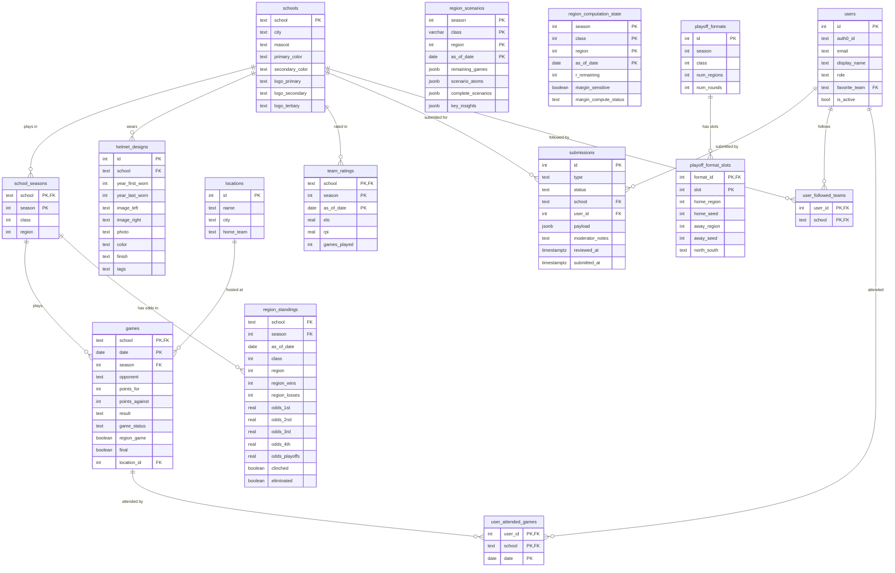

# Schema Diagram

```mermaid
erDiagram
    schools {
        text school PK
        text city
        text mascot
        text primary_color
        text secondary_color
        text logo_primary
        text logo_secondary
        text logo_tertiary
    }
    helmet_designs {
        int id PK
        text school FK
        int year_first_worn
        int year_last_worn
        text image_left
        text image_right
        text photo
        text color
        text finish
        text tags
    }
    school_seasons {
        text school PK,FK
        int season PK
        int class
        int region
    }
    locations {
        int id PK
        text name
        text city
        text home_team
    }
    games {
        text school PK,FK
        date date PK
        int season FK
        text opponent
        int points_for
        int points_against
        text result
        text game_status
        boolean region_game
        boolean final
        int location_id FK
    }
    region_standings {
        text school FK
        int season FK
        date as_of_date
        int class
        int region
        int region_wins
        int region_losses
        real odds_1st
        real odds_2nd
        real odds_3rd
        real odds_4th
        real odds_playoffs
        boolean clinched
        boolean eliminated
    }
    team_ratings {
        text school PK,FK
        int season PK
        date as_of_date PK
        real elo
        real rpi
        int games_played
    }
    region_scenarios {
        int season PK
        varchar class PK
        int region PK
        date as_of_date PK
        jsonb remaining_games
        jsonb scenario_atoms
        jsonb complete_scenarios
        jsonb key_insights
    }
    region_computation_state {
        int season PK
        int class PK
        int region PK
        date as_of_date PK
        int r_remaining
        boolean margin_sensitive
        text margin_compute_status
    }
    playoff_formats {
        int id PK
        int season
        int class
        int num_regions
        int num_rounds
    }
    playoff_format_slots {
        int format_id PK,FK
        int slot PK
        int home_region
        int home_seed
        int away_region
        int away_seed
        text north_south
    }

    submissions {
        int id PK
        text type
        text status
        text school FK
        int user_id FK
        jsonb payload
        text moderator_notes
        timestamptz reviewed_at
        timestamptz submitted_at
    }
    users {
        int id PK
        text auth0_id
        text email
        text display_name
        text role
        text favorite_team FK
        bool is_active
    }
    user_followed_teams {
        int user_id PK,FK
        text school PK,FK
    }
    user_attended_games {
        int user_id PK,FK
        text school PK,FK
        date date PK
    }

    schools ||--o{ school_seasons : "plays in"
    schools ||--o{ helmet_designs : "wears"
    schools ||--o{ team_ratings : "rated in"
    schools ||--o{ submissions : "submitted for"
    schools ||--o{ user_followed_teams : "followed by"
    users ||--o{ submissions : "submitted by"
    users ||--o{ user_followed_teams : "follows"
    users ||--o{ user_attended_games : "attended"
    games ||--o{ user_attended_games : "attended by"
    school_seasons ||--o{ games : "plays"
    school_seasons ||--o{ region_standings : "has odds in"
    locations ||--o{ games : "hosted at"
    playoff_formats ||--o{ playoff_format_slots : "has slots"
```
