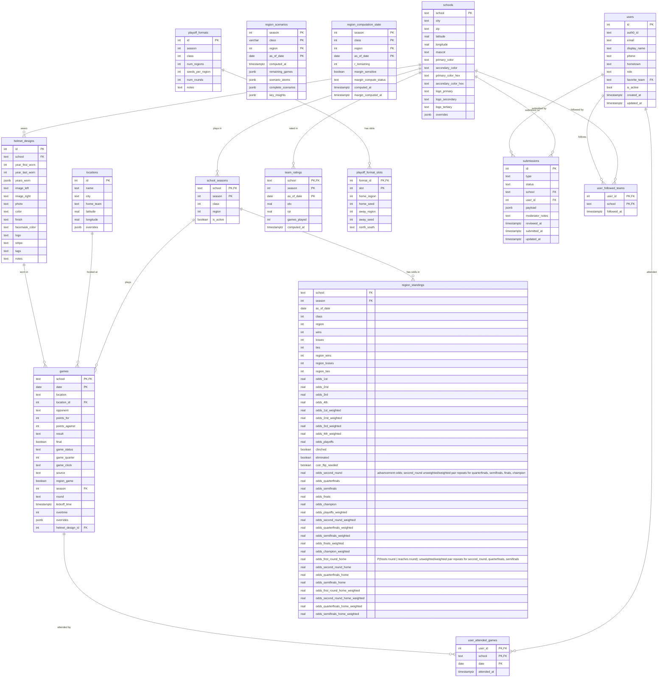

# Schema Diagram

`schools`, `games`, and `locations` each have an `overrides` JSONB column and a matching
`*_effective` view (`schools_effective`, `games_effective`, `locations_effective`) that merges
the override over the raw column. All reads (API and pipeline) go through the `*_effective`
views; all writes go to the base tables, and `overrides` is never written by the pipeline —
only via the admin override endpoints. See [API_REFERENCE.md](API_REFERENCE.md#admin--admin).

